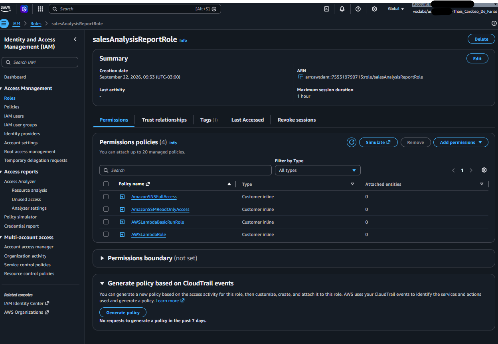
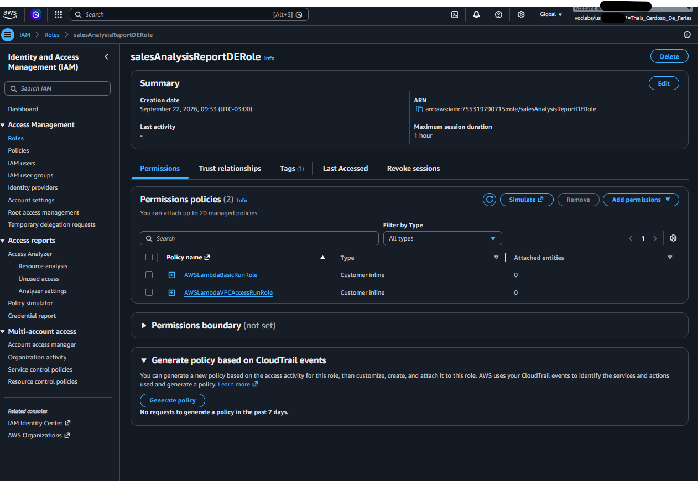
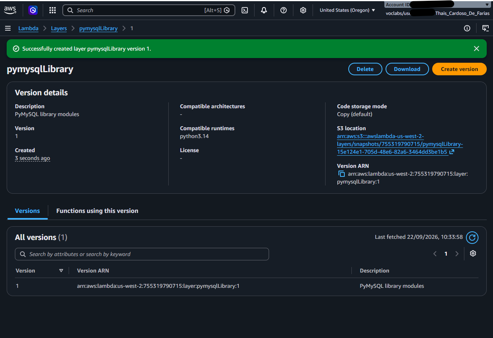
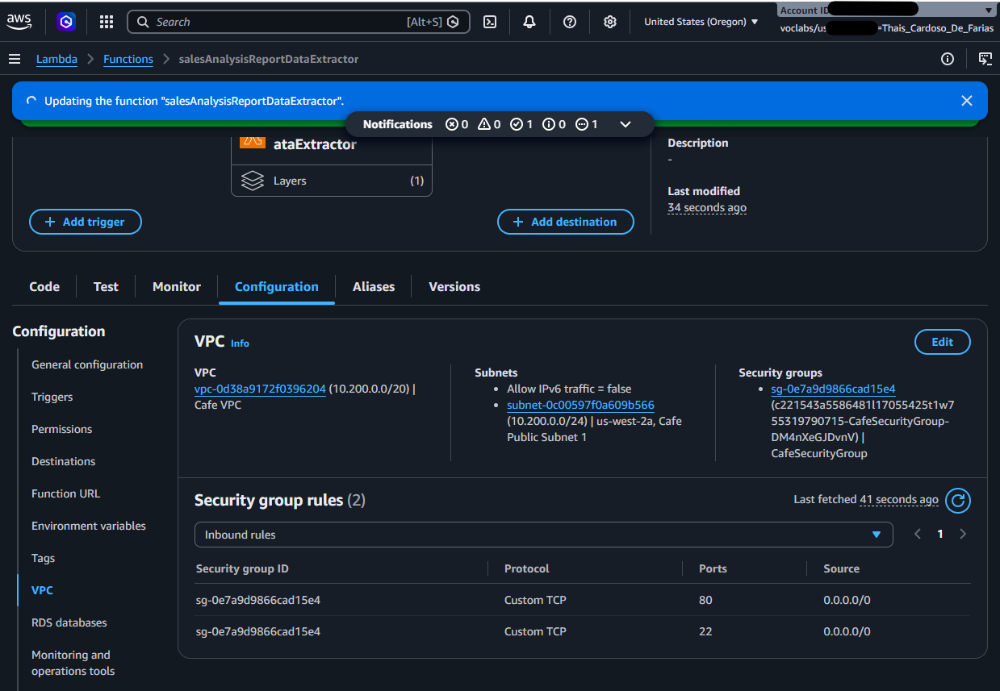
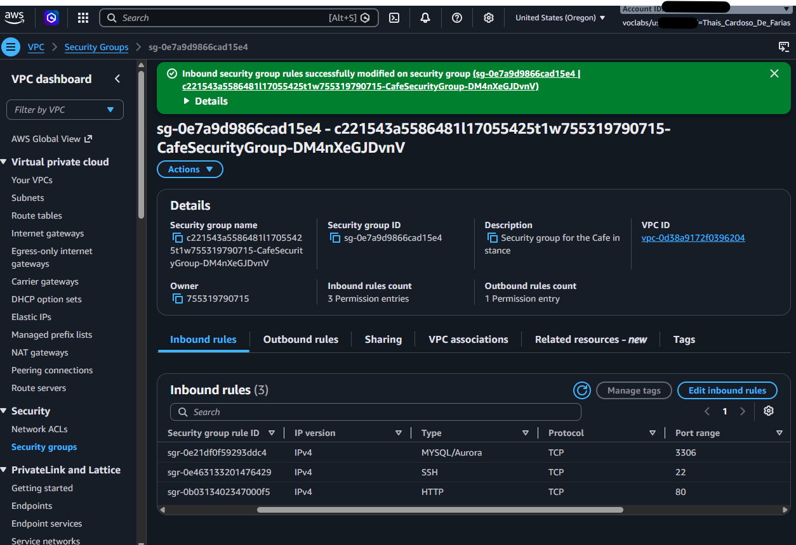
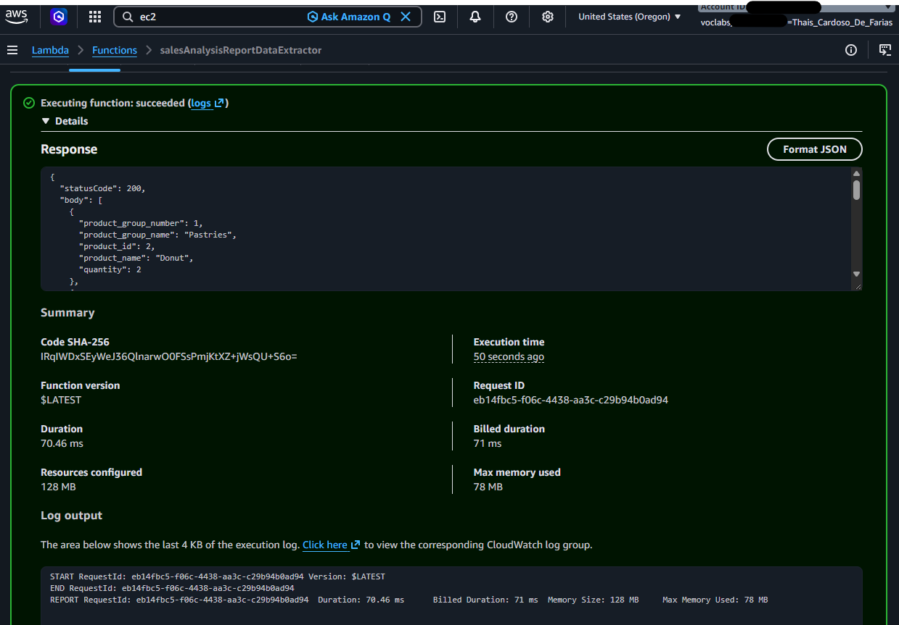
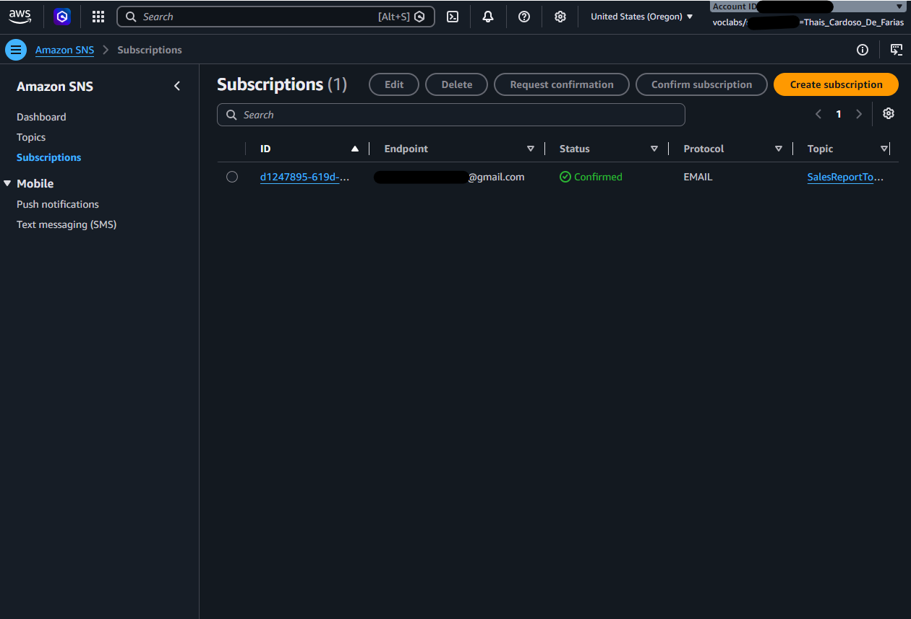
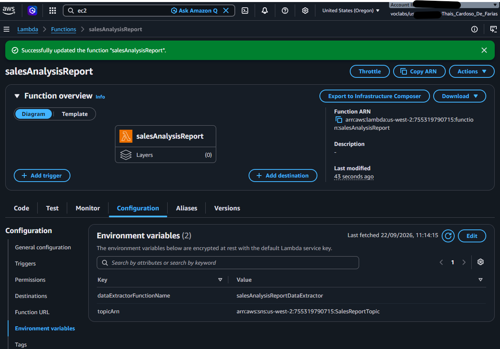
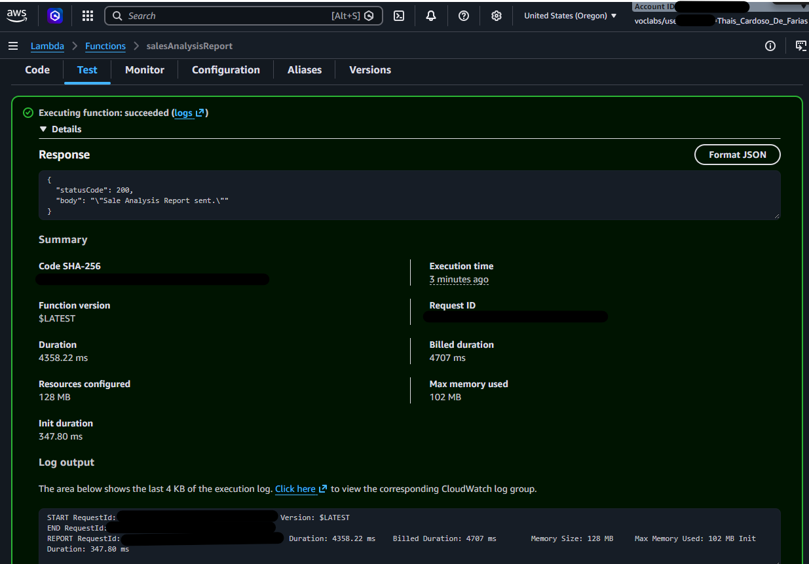
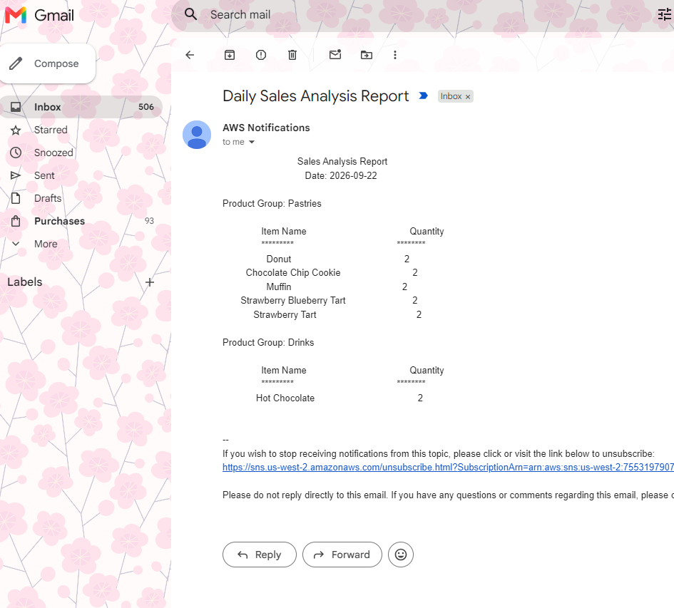

# ☕ Arquitetura Serverless para Relatório Automatizado de Vendas na AWS

## 📌 Visão Geral do Projeto
Este projeto consiste na implementação de uma solução **Serverless e Orientada a Eventos (Event-Driven Architecture)** na AWS para automação e geração diária de relatórios de vendas de uma empresa fictícia (Café). 

A arquitetura extrai dados de vendas de um banco de dados **MySQL** hospedado em uma instância EC2 privada, formata os dados consolidados e dispara notificações por e-mail para os gestores através do **Amazon SNS**.

---

## 📐 Arquitetura da Solução

```text
[ CloudWatch Event / Cron ]
           │
           ▼
[ Lambda Orchestrator ] ────► [ Systems Manager (Parameter Store) ]
   (salesAnalysisReport)                    │ (Busca Credenciais)
           │                                ▼
           ├──────────────────► [ Lambda Data Extractor ]
           │                       (salesAnalysisReportDataExtractor)
           │                                │ (Consulta SQL na Porta 3306)
           │                                ▼
           │                      [ EC2 / MySQL Database ]
           │                         (Cafe VPC - Private)
           ▼
[ Amazon SNS Topic ]
  (SalesReportTopic)
           │
           ▼
[ Email Administrator ]
```

### 🛠️ Serviços AWS Utilizados
* **AWS Lambda & Lambda Layers:** Processamento Serverless e gerenciamento de dependências externas (`PyMySQL`).
* **Amazon SNS (Simple Notification Service):** Serviço de mensageria Pub/Sub para envio do relatório por e-mail.
* **AWS Systems Manager (Parameter Store):** Armazenamento seguro e centralizado das credenciais e strings de conexão do banco de dados.
* **Amazon VPC, Subnets & Security Groups:** Configuração de rede e segurança para isolar o acesso ao banco de dados MySQL na porta 3306.
* **AWS IAM (Identity and Access Management):** Aplicação do princípio do menor privilégio através de *Roles* e *Policies*.
* **AWS CLI (EC2 Instance Connect):** Atualização e gerenciamento de código de funções Serverless via linha de comando.

---

## 🧠 Principais Conhecimentos e Competências Adquiridos

1. **Gestão de Dependências com Lambda Layers:** Criação e vinculação de camadas reutilizáveis para disponibilizar bibliotecas Python externas (`pymysql`) sem poluir o pacote de implantação da função.
2. **Integração de Lambdas em VPCs Privadas:** Configuração de ENIs (Interfaces de Rede Elásticas) para permitir que funções Serverless acessem recursos em redes privadas de forma segura.
3. **Troubleshooting de Rede e Segurança Cloud:** Diagnóstico e resolução de erros de *Timeout* no Lambda identificando bloqueios de porta TCP (3306) em *Security Groups*.
4. **Desacoplamento e Mensageria (Pub/Sub):** Integração do Lambda com o Amazon SNS para notificação por e-mail assíncrona.
5. **Boas Práticas de Segurança em Credenciais:** Substituição de senhas em código estático pelo consumo dinâmico de parâmetros do Parameter Store.
6. **Automação via AWS CLI:** Deploy de pacotes ZIP em funções Lambda diretamente pelo terminal Linux utilizando a interface de linha de comando oficial da AWS.

---

## 📸 Evidências e Passo a Passo da Implementação

### 1. Inspeção de Permissões e Segurança (IAM)
Verificação das *Roles* e *Policies* necessárias para garantir que as funções Lambda tenham permissões estritas para acionar o SNS, registrar logs no CloudWatch e acessar a VPC.

| Role de Execução Principal | Role do Extrator de Dados |
| :---: | :---: |
|  |  |

---

### 2. Gestão de Dependências e Rede no Lambda
Criação da Lambda Layer com o driver `pymysql` e inclusão da função `salesAnalysisReportDataExtractor` na Cafe VPC com as subredes e Security Groups corretos.

| Criação da Lambda Layer (PyMySQL) | Configuração de VPC no Lambda |
| :---: | :---: |
|  |  |

---

### 3. Troubleshooting e Ajuste de Regras de Entrada (Security Group)
Identificação da falha de *Timeout* ao tentar conectar ao banco de dados e resolução com a liberação do tráfego MySQL/Aurora (Porta 3306) no Security Group do banco.



---

### 4. Teste e Validação da Extração de Dados
Após gerar pedidos reais na aplicação Web do Café, a função extratora consultou com sucesso a base MySQL e retornou os dados estruturados em JSON.



---

### 5. Configuração do Tópico de Notificação (Amazon SNS)
Criação do tópico `SalesReportTopic` e confirmação da assinatura de e-mail para o envio do relatório automatizado.



---

### 6. Configuração de Variáveis de Ambiente e Orquestração
Definição das chaves `topicARN` e `dataExtractorFunctionName` nas variáveis de ambiente da função orquestradora para garantir a comunicação dinâmica entre os componentes.



---

### 7. Validação End-to-End da Solução
Execução da função orquestradora `salesAnalysisReport` recebendo o código HTTP 200 OK e o recebimento do relatório formatado na caixa de e-mail.

| Sucesso da Execução no Console AWS | E-mail de Relatório Recebido |
| :---: | :---: |
|  |  |

